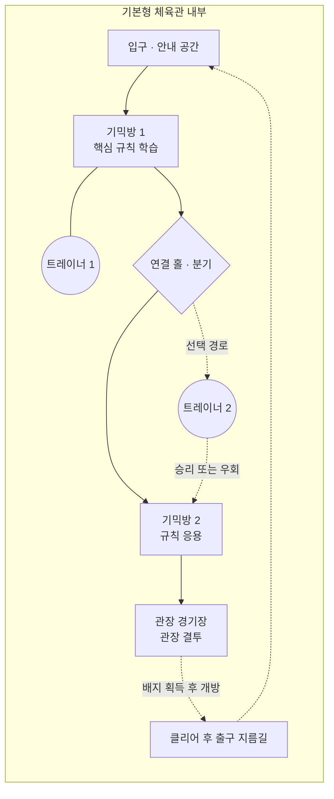

# 체육관 기본 구조와 기믹 아이디어 카탈로그

이 문서는 체육관의 공통 진행 구조와 재사용 가능한 기믹 아이디어를 정리한다. 특정
체육관의 구현 사양을 확정하는 문서가 아니라, 새로운 아이디어를 계속 추가하고 실제
체육관을 기획할 때 조합해 사용하는 기반 문서다.

기본 방향은 **포켓몬 본가의 체육관 진행 감각을 우선**하는 것이다. Minecraft와 Create
요소는 세계관의 전면에 내세우기보다 이동 발판, 바람, 회전 벽처럼 기믹을 구현하는
수단으로 가볍게 사용한다.

## 1. 체육관 기본형

모든 일반 체육관은 다음 구성에서 시작한다.

```text
[입구]
   ↓
[기믹방 1] ─ 트레이너
   ↓
[기믹방 2] ─ 트레이너 또는 우회로
   ↓
[관장 경기장]
   ↓
[배지 획득 / 출구 지름길]
```

| 공간 | 필수 여부 | 역할 |
| --- | --- | --- |
| 입구 | 필수 | 체육관 테마, 규칙, 현재 진행 상태를 안내한다. |
| 기믹방 | 필수 | 짧은 퍼즐이나 이동 기믹과 체육관 트레이너를 배치한다. |
| 연결 통로 | 선택 | 방 사이의 시야를 끊고 다음 기믹을 준비할 여유를 준다. |
| 관장 경기장 | 필수 | 관장과 결투하며, 퍼즐보다 전투 연출에 집중한다. |
| 출구 지름길 | 권장 | 클리어 후 기믹을 다시 통과하지 않고 입구로 돌아간다. |

### 기본형 공간 배치 초안

아래 도식은 기본형 체육관을 위에서 내려다본 개념 배치다. 방의 정확한 블록 크기를
지정하는 설계도가 아니라, 공간의 인접 관계와 플레이어 진행 방향을 정하는 기준으로
사용한다.



```text
┌──────────────────── 체육관 전체 ────────────────────┐
│                                                      │
│                 ┌──── 관장 경기장 ────┐              │
│                 │       관장           │              │
│                 └─────────▲────────────┘              │
│                           │                           │
│                 ┌──── 기믹방 2 ───────┐              │
│                 │ 응용 기믹 + 트레이너 │              │
│                 └─────────▲────────────┘              │
│                           │                           │
│  출구 지름길 ◀────── 연결 홀·분기                    │
│       │                   ▲                           │
│       │         ┌──── 기믹방 1 ───────┐              │
│       │         │ 학습 기믹 + 트레이너 │              │
│       │         └─────────▲────────────┘              │
│       │                   │                           │
│       └───────────────┌───┴────┐                      │
│                       │  입구  │                      │
│                       └────────┘                      │
└──────────────────────────────────────────────────────┘
```

공간을 실제로 만들 때는 다음 관계를 유지한다.

- 입구에서는 첫 기믹 전체가 아니라 규칙을 이해할 수 있는 일부만 보이게 한다.
- 기믹방은 트레이너 전투가 발생해도 다른 이동 장치에 밀리거나 떨어지지 않을 만큼의
  안전 영역을 포함한다.
- 연결 홀은 다음 방을 미리 보여주고 선택 트레이너나 우회로를 배치하는 완충 공간이다.
- 관장 경기장은 기믹방보다 넓고 시야가 트여야 하며, 입장 순간 관장이 정면에 보이게
  한다.
- 출구 지름길은 관장전 승리 전에는 사용할 수 없고, 개방 후에는 입구와 바로 연결된다.

### 기본 운영 규칙

- 일반 체육관에는 관장 1명과 체육관 트레이너 여러 명이 있다.
- 관장과의 결투는 기본적으로 필수이며 체육관의 마지막 목표다.
- 기믹 하나는 처음 접한 플레이어가 설명을 포함해 약 30~60초 안에 이해할 수 있는
  규모를 우선한다.
- 긴 점프맵 하나보다 짧은 기믹과 트레이너 전투가 번갈아 나오는 흐름을 우선한다.
- 일반 트레이너는 체육관당 3~5명을 기준으로 하되 공간과 난이도에 따라 조정한다.
- 트레이너 전투 뒤에는 장치를 관찰하거나 다음 행동을 결정할 짧은 안전 공간을 둔다.
- 추락하거나 퍼즐을 초기화해도 이미 승리한 트레이너와 즉시 재대결하지 않게 한다.
- 관장 앞에는 체크포인트나 입구로 돌아갈 수 있는 경로를 둔다.

## 2. 기믹방 조립 단위

기믹방은 아래 요소를 선택해서 조립한다. 모든 방에 요소를 전부 넣을 필요는 없다.

| 요소 | 설명 |
| --- | --- |
| 목표 | 출구 도달, 스위치 작동, 올바른 길 찾기처럼 방에서 해야 할 일 |
| 핵심 규칙 | 미끄러짐, 강제 이동, 워프처럼 플레이어가 익혀야 할 규칙 하나 |
| 트레이너 | 필수 전투, 선택 전투, 시야 회피 또는 힌트 제공 역할 |
| 실패 상태 | 시작점 복귀, 짧은 낙하, 잘못된 방 진입 또는 퍼즐 초기화 |
| 피드백 | 조명, 소리, 문 개방, 색상 변화 등 성공과 실패를 알리는 표현 |
| 복구 장치 | 리셋 버튼, 체크포인트, 우회 계단 또는 자동 복귀 지점 |

기믹방 하나에는 가능한 한 핵심 규칙을 하나만 둔다. 두 기믹을 결합할 때는 앞선 방에서
각 규칙을 먼저 경험하게 한 뒤 마지막 방에서 조합한다.

## 3. 기믹 아이디어 목록

### 3.1 이동 기믹

| 기믹 | 진행 방식 | 트레이너 연결 | 구현 메모 |
| --- | --- | --- | --- |
| 얼음 바닥 | 장애물에 닿을 때까지 한 방향으로 미끄러진다. | 정지 지점이나 갈림길을 트레이너가 지킨다. | 얼음 블록과 벽 배치로 단순 구현한다. |
| 방향 이동 타일 | 타일에 올라가면 표시된 방향으로 이동한다. | 잘못 선택한 경로가 선택 전투로 이어진다. | Create 벨트는 바닥 장치처럼 숨겨 사용한다. |
| 바람 통로 | 바람을 타고 상승하거나 반대편 발판으로 이동한다. | 착지 지점이나 바람 제어 스위치 앞에 배치한다. | Create 선풍기는 환풍구나 장식 뒤에 감춘다. |
| 움직이는 발판 | 왕복하거나 회전하는 발판의 타이밍에 맞춰 건넌다. | 발판을 건넌 뒤 전투하도록 안전 공간을 둔다. | Create 장치를 사용할 수 있으나 기계실 분위기는 강제하지 않는다. |
| 물살 | 흐름을 따라 이동하고 분기점에서 경로를 선택한다. | 작은 섬, 부두 또는 수문 앞에 배치한다. | 물 타입 체육관에 우선 사용한다. |
| 낙하 구멍 | 여러 구멍 중 다음 구역으로 이어지는 위치를 찾는다. | 잘못된 구멍이 트레이너 방이나 이전 층으로 연결된다. | 큰 낙하 피해 대신 짧은 복귀를 사용한다. |
| 회전 발판 | 발판이나 방이 회전해 새로운 통로와 연결된다. | 회전 전후에 접근 가능한 트레이너가 달라진다. | Mechanical Bearing은 구조물 내부에 숨길 수 있다. |
| 점프 구간 | 짧은 발판 구간을 통과한다. | 점프 직전보다 착지 후에 트레이너를 둔다. | 긴 정밀 점프맵은 피하고 체크포인트를 둔다. |

### 3.2 경로와 공간 변화 기믹

| 기믹 | 진행 방식 | 트레이너 연결 | 구현 메모 |
| --- | --- | --- | --- |
| 워프 타일 | 여러 방을 이동하며 관장에게 가는 경로를 찾는다. | 일부 워프가 트레이너 방으로 연결된다. | 목적지를 색상이나 문양으로 암시할 수 있다. |
| 스위치 문 | 스위치로 문, 다리 또는 벽의 상태를 바꾼다. | 스위치를 트레이너가 지키거나 승리 후 사용할 수 있다. | 레드스톤이나 Create 장치는 벽 뒤에서 작동한다. |
| 회전 벽 | 벽이나 문을 회전해 방의 연결 구조를 변경한다. | 구조 변경에 따라 새로운 트레이너 경로가 열린다. | 현재 연결 상태를 바닥 색으로 표시한다. |
| 밀기 퍼즐 | 바위나 상자를 밀어 길 또는 발판을 완성한다. | 트레이너가 작업 공간 일부를 차지하거나 힌트를 준다. | 막혔을 때 즉시 초기화할 수 있어야 한다. |
| 투명 통로 | 보이지 않거나 희미한 벽 사이에서 길을 찾는다. | 막다른 길에 선택 트레이너를 배치한다. | 완전한 무정보보다 바닥·조명으로 약한 힌트를 준다. |
| 다층 경로 | 계단, 승강기 또는 낙하를 이용해 층을 오간다. | 각 층에 역할이 다른 트레이너를 배치한다. | 현재 층과 목적지를 알아보기 쉽게 표시한다. |

### 3.3 관찰과 판단 기믹

| 기믹 | 진행 방식 | 트레이너 연결 | 구현 메모 |
| --- | --- | --- | --- |
| 퀴즈 문 | 문제를 맞히면 통과하고 틀리면 다른 결과가 발생한다. | 오답 시 전투하거나, 전투를 선택해 문제를 건너뛴다. | 포켓몬 상식과 체육관 테마를 문제로 사용한다. |
| 순서 기억 | 빛, 소리 또는 문양의 순서를 기억해 재입력한다. | 승리한 트레이너가 순서 일부를 알려준다. | 반복 실패 시 힌트를 강화한다. |
| 짝 맞추기 | 같은 문양이나 포켓몬 타입 조합을 찾는다. | 잘못된 선택이 선택 전투로 이어질 수 있다. | 텍스트보다 색과 아이콘을 우선한다. |
| 조명 복구 | 어두운 공간에서 스위치를 찾아 순서대로 밝힌다. | 조명 구역마다 트레이너가 나타나거나 길을 지킨다. | 완전한 암흑과 과도한 화면 방해는 피한다. |
| 소리 단서 | 울음소리나 음계를 듣고 올바른 방향을 선택한다. | 트레이너 대사로 단서의 규칙을 설명한다. | 소리를 듣지 못해도 보조 시각 단서를 제공한다. |

### 3.4 트레이너 중심 기믹

| 기믹 | 진행 방식 | 구현 메모 |
| --- | --- | --- |
| 문지기 | 트레이너에게 승리하면 뒤쪽 문이나 발판이 열린다. | 가장 단순한 필수 전투 배치다. |
| 시야 회피 | 순찰하거나 회전하는 트레이너의 시야를 피해 이동한다. | 들키면 전투하고, 성공하면 우회할 수 있다. |
| 선택 경로 | 쉬운 퍼즐과 강한 트레이너 중 하나를 선택한다. | 두 경로의 소요 시간과 보상을 비슷하게 맞춘다. |
| 힌트 전투 | 트레이너에게 승리하면 다음 퍼즐의 규칙이나 단서를 알려준다. | 대사는 선택적으로 다시 확인할 수 있게 한다. |
| 연속 도전 | 여러 트레이너와 순서대로 싸워 기믹을 해제한다. | 전투 사이 회복 규칙과 중단 시 복귀 지점을 명확히 한다. |
| 위치 변화 | 퍼즐 상태에 따라 만날 수 있는 트레이너가 달라진다. | 모든 트레이너를 필수로 만들지 않아 재방문 가치를 준다. |

## 4. Minecraft와 Create 요소 사용 기준

Minecraft 요소는 플레이어가 조작법을 직관적으로 이해하도록 돕는 수준으로 사용한다.
체육관 전체가 공장이나 레드스톤 실험실처럼 보여야 할 필요는 없다.

| 표현하려는 기믹 | 사용할 수 있는 수단 | 권장 표현 |
| --- | --- | --- |
| 방향 이동 타일 | Create 벨트 | 바닥 패턴이나 화살표 타일 |
| 상승기류·측풍 | Create 선풍기 | 환풍구, 포켓몬 조형물, 자연 바람 |
| 회전 방·발판 | Bearing과 Contraption | 회전 무대, 벽, 석상 |
| 승강기·이동 다리 | Pulley, Piston, Contraption | 체육관 승강기나 접이식 통로 |
| 문과 상태 변화 | 레드스톤 또는 Create 동력 | 스위치에 반응하는 일반 체육관 장치 |

다음 기준을 함께 적용한다.

- 노출된 축, 톱니바퀴와 기계 장식은 해당 체육관 테마에 어울릴 때만 사용한다.
- Create 장치의 사용법 자체를 알아야만 풀 수 있는 퍼즐은 별도 기계 테마 체육관에만
  사용한다.
- 장치가 작동할 때 진행 방향과 결과를 조명, 색상, 소리로 명확하게 보여준다.
- 서버 지연이나 여러 플레이어의 동시 조작으로 장치 상태가 꼬이지 않도록 리셋 상태를
  정의한다.

## 5. 난이도와 플레이 흐름

기본형 체육관은 다음 리듬을 권장한다.

1. 입구에서 테마와 규칙을 짧게 안내한다.
2. 첫 기믹방에서 안전하게 핵심 규칙을 학습한다.
3. 첫 트레이너 전투로 진행을 잠시 전환한다.
4. 두 번째 기믹방에서 규칙을 변형하거나 선택 경로를 제시한다.
5. 마지막 트레이너 또는 종합 기믹을 통과한다.
6. 관장 경기장에 진입해 결투한다.
7. 승리 후 배지를 받고 입구까지 지름길을 연다.

퍼즐 난이도는 정답을 떠올리는 어려움보다 같은 동작을 여러 번 반복하는 피로가 커지지
않도록 조정한다. 실패할 때는 원인을 이해할 수 있어야 하며, 복귀 시간은 짧게 유지한다.

## 6. 새 기믹 아이디어 추가 양식

새로운 아이디어는 적절한 기믹 목록에 한 줄로 먼저 추가하고, 구체화가 필요하면 아래
양식을 복사해 이 절 아래에 기록한다.

```markdown
### 기믹 이름

- 상태: 아이디어 / 검토 중 / 채택 / 구현 중 / 구현 완료 / 보류
- 어울리는 타입 또는 테마:
- 한 줄 설명:
- 플레이어 목표:
- 핵심 규칙:
- 트레이너 연결 방식:
- 성공 조건:
- 실패 및 복구 방식:
- 예상 소요 시간:
- 필요한 Minecraft/Create 요소:
- 멀티플레이 고려사항:
- 참고한 포켓몬 기믹:
- 추가 메모:
```

## 7. 체육관별 기획 양식

실제 체육관을 설계할 때 아래 양식을 별도 문서나 이 절의 하위 항목으로 복사한다.

```markdown
### 체육관 이름

- 상태: 아이디어 / 설계 중 / 제작 중 / 검증 중 / 완료
- 관장:
- 타입 또는 테마:
- 핵심 기믹:
- 보조 기믹:
- 일반 트레이너 수:
- 필수 전투 수:
- 선택 전투 수:
- 예상 전체 소요 시간:

#### 진행 순서

1. 입구:
2. 기믹방 1:
3. 기믹방 2:
4. 관장 경기장:
5. 클리어 후 출구:

#### 실패 및 복구

- 체크포인트:
- 퍼즐 초기화:
- 추락 또는 이탈 복구:
- 멀티플레이 상태 처리:

#### 제작 메모

- 필요한 구조물 모듈:
- 필요한 NPC 앵커:
- 필요한 모드 또는 장치:
- 미결정 사항:
```

## 8. 현재 결정 사항과 미결정 사항

### 현재 결정 사항

- 첫 번째 공통 템플릿은 관장과 일반 트레이너가 있는 `기본형`으로 만든다.
- 기본형은 입구, 하나 이상의 기믹방, 관장 경기장을 가진다.
- 일반적인 체육관의 마지막에는 관장과의 결투가 있다.
- 포켓몬식 기믹과 전투 흐름을 우선하고 Minecraft/Create 표현은 가볍게 사용한다.

### 미결정 사항

- 기본형에 포함할 기믹방의 기본 개수와 최대 개수
- 체육관당 필수·선택 트레이너 수의 정확한 범위
- 싱글플레이와 여러 플레이어가 동시에 입장했을 때의 퍼즐 상태 소유권
- 패배, 퇴장 또는 서버 재시작 뒤 퍼즐 상태를 유지할지 여부
- 관장전 직전 회복과 재도전 규칙
- 체육관별 기믹 문서를 한 파일에 모을지 개별 파일로 분리할지 여부
